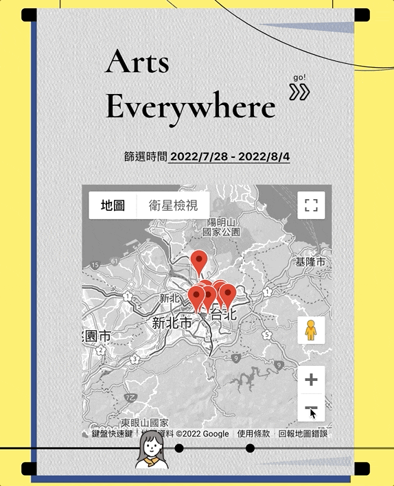
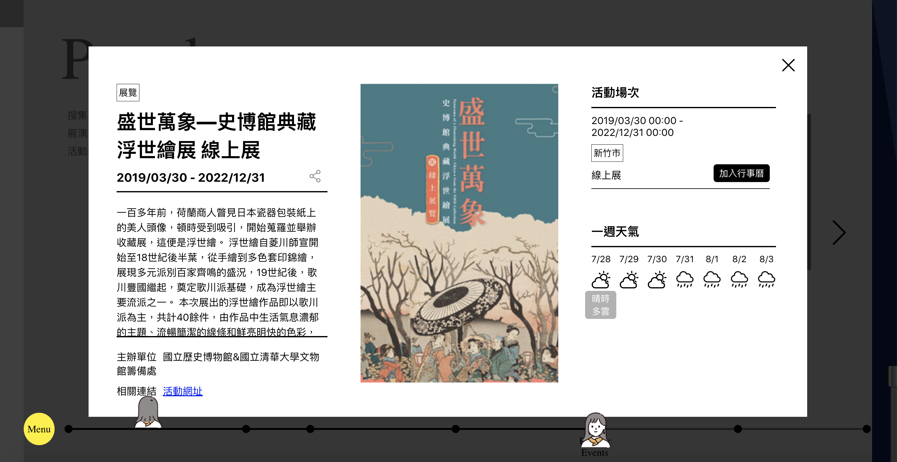
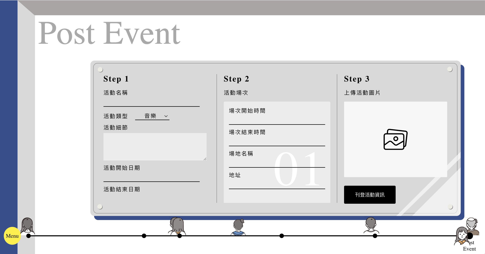

[Arts Everywhere](https://arts-everywhere-108b3.web.app/),
an immersive exhibition website with information of nationwide art events.

* Implemented `real-time multiple-user interactivity` to enhance presence by storing users' scrolled position in Firestore and getting immediate position change.
* Realized immersive art exhibition experiences through `horizontal scrolling` and added event listener on wheel to scroll page.
* Connected with `weather` and `Google Maps API` to provide weather and geographic information to help users make their schedule.
* Provided `event searching function` with calculating date and latitude-longitude coordinates.
* Accomplished `event posting function` by handling form with `React Hook Form` and uploading images with `Firebase Storage`.
* Preprocessed over `5,000` external event data with `Python`.
* Used `Storybook` as a tool for UI development.

# Features

* Horizontal scrolling!

* Visit the website with other users.

* Search events by selecting date and location.

* Discover more events by draging the map!

* Read event details.

* Post artistic events by writing event details and uploading images.

# Demo link

For your complete user experience, please login with the account provided below

Web: https://arts-everywhere-108b3.web.app/

User: tester@gmail.com

Password: testertester

# Technologies

> Front-End Fundamental

- HTML / CSS / JavaScript
- RWD

> Libraries

- React / React Hooks
- React Router
- Styled Components

> Firebase

- Cloud Firestore
- Cloud Functions
- Authentication
- Hosting

> Packages

- Google maps API
- React Datepicker
- React Hook Form
- React-toastify

> Tools

- Git & GitHub
- npm
- ESLint
- Storybook

# Contact Me

If you got any problem or suggestion with Arts Everywhere, please feel free to contact with me via email.

Author: Ting-Wei 

Email: tingwei0518@gmail.com
